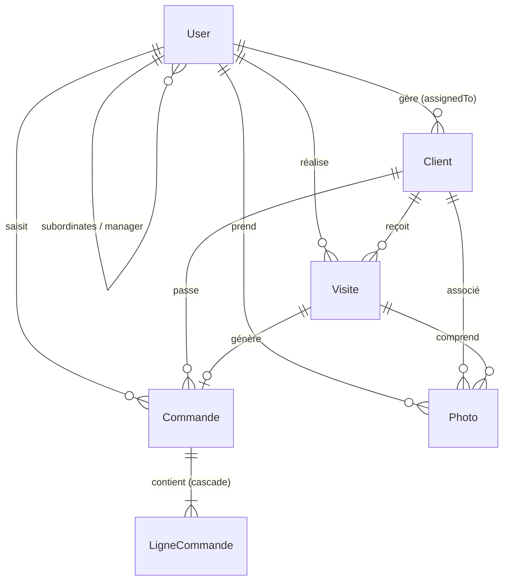

# 🗄️ Modèle de Données et Base de Données

L'application **SalesTrack** utilise un schéma de base de données relationnel géré par l'ORM **Prisma**. Dans l'environnement Docker, la base est motorisée par **MySQL 8**.

---

## 🗺️ Diagramme et Modèles de Données

Voici la description détaillée de chaque table (modèle Prisma) et de ses relations.

---

### 1. Utilisateur (`User`)
Représente les comptes de l'application avec différents privilèges d'accès.

| Champ | Type Prisma | Description |
| :--- | :--- | :--- |
| `id` | `Int` (PK, Auto) | Identifiant unique. |
| `email` | `String` (Unique) | Adresse de connexion de l'utilisateur. |
| `passwordHash` | `String` | Mot de passe haché avec bcrypt. |
| `firstName` | `String` | Prénom de l'utilisateur. |
| `lastName` | `String` | Nom de l'utilisateur. |
| `phone` | `String?` (Null) | Numéro de téléphone. |
| `role` | `String` | Rôle de l'utilisateur : `ADMIN`, `MANAGER`, `COMMERCIAL`. |
| `equipe` | `String?` (Null) | Nom de l'équipe (surtout utilisé pour les managers). |
| `managerId` | `Int?` (Null) | Auto-relation : ID du manager supervisant ce membre de l'équipe. |

---

### 2. Client (`Client`)
Représente les comptes clients (points de vente, épiceries, etc.) démarchés.

| Champ | Type Prisma | Description |
| :--- | :--- | :--- |
| `id` | `Int` (PK, Auto) | Identifiant unique. |
| `code` | `String` (Unique) | Code d'identification unique (ex: CL001). |
| `companyName` | `String` | Raison sociale / Nom de l'établissement. |
| `phone` | `String` | Téléphone principal du client. |
| `email` | `String` | Adresse email de contact. |
| `address` | `String` | Adresse physique complète. |
| `city` | `String` | Ville. |
| `distributionChannel`| `String` | Canal de distribution : `ON_TRADE` (consommation sur place) ou `OFF_TRADE` (à emporter). |
| `category` | `String` | Catégorie de point de vente : `HOTEL`, `RESTAURANT`, `CAFE`, `GROCERY` (Épicerie), `SUPERMARKET` (GMS), `TRADITIONAL` (Traditionnel), `OTHER`. |
| `status` | `String` | Statut du compte : `ACTIVE` (Actif), `INACTIVE` (Inactif), `PROSPECT`. |
| `assignedTo` | `Int` (FK) | ID du commercial attitré à ce client. |
| `notes` | `String?` (Null) | Remarques internes additionnelles. |

---

### 3. Visite (`Visite`)
Enregistre chaque déplacement d'un commercial chez un client.

| Champ | Type Prisma | Description |
| :--- | :--- | :--- |
| `id` | `Int` (PK, Auto) | Identifiant unique. |
| `clientId` | `Int` (FK) | Client visité. |
| `commercialId` | `Int` (FK) | Commercial ayant effectué la visite. |
| `dateDebut` | `DateTime` (Default) | Date et heure de début de visite (générée côté SERVEUR uniquement). |
| `objet` | `String` | Motif de la visite : `PRISE_COMMANDE`, `SUIVI_CLIENT`, `RECOUVREMENT`, `VISIBILITE_MARQUE`, `IMPLANTATION_PRODUIT`, `NEGOCIATION`, `LIVRAISON`, `RELANCE`, `AUTRE`. |
| `commentaire` | `String` | Notes saisies par le commercial suite à la visite. |
| `statutCommande` | `String` | Indique s'il y a eu commande : `COMMANDE` ou `NON_COMMANDE`. |
| `raisonNonCommande`| `String?` (Null) | Si `NON_COMMANDE` : `STOCK_NON_ECOULE`, `TROP_STOCK`, `BAISSE_ACTIVITE`, `CHANGEMENT_FOURNISSEUR`, `PRIX_ELEVE`, `CLIENT_ABSENT`, `ATTENTE_VALIDATION`, `PROBLEME_LIVRAISON`, `AUTRE`. |
| `problemesConstates`| `String?` (Null) | Problèmes signalés : `LIVRAISON`, `FACTURATION`, `STOCK`, `QUALITE`, `AUTRE`. |
| `latitude` | `Float?` (Null) | Coordonnées GPS capturées. |
| `longitude` | `Float?` (Null) | Coordonnées GPS capturées. |

---

### 4. Commande (`Commande`)
Représente les commandes et devis passés par le biais des visites terrain ou saisis directement.

| Champ | Type Prisma | Description |
| :--- | :--- | :--- |
| `id` | `Int` (PK, Auto) | Identifiant unique. |
| `clientId` | `Int` (FK) | Client concerné. |
| `commercialId` | `Int` (FK) | Commercial émetteur. |
| `visiteId` | `Int?` (FK, Null) | ID de la visite associée (optionnel, si commandé en cours de visite). |
| `type` | `String` | Type de document : `COMMANDE` ou `DEVIS`. |
| `statut` | `String` | État : `BROUILLON`, `EN_ATTENTE`, `VALIDEE`, `TRAITEE`, `ANNULEE`. |
| `totalHT` | `Float` | Montant total recalculé côté serveur (somme des lignes). |

---

### 5. Ligne de Commande (`LigneCommande`)
Contient le détail des articles commandés au sein d'une commande ou d'un devis.

| Champ | Type Prisma | Description |
| :--- | :--- | :--- |
| `id` | `Int` (PK, Auto) | Identifiant unique. |
| `commandeId` | `Int` (FK, Cascade)| Commande parente (supprimée automatiquement si la commande est effacée). |
| `designation` | `String` | Nom de l'article / Produit. |
| `reference` | `String` | Référence unique de l'article (SKU). |
| `conditionnement` | `String` | Type d'emballage (ex: Carton de 24, Fût 30L). |
| `quantite` | `Int` | Quantité commandée. |
| `prixUnitaireHT` | `Float` | Tarif unitaire hors taxes. |
| `remise` | `Float` (Default: 0)| Taux de remise appliqué en pourcentage (ex: 5 pour 5%). |
| `totalLigneHT` | `Float` | Calculé : `quantite * prixUnitaireHT * (1 - remise / 100)`. |

---

### 6. Photo (`Photo`)
Photos prises sur le terrain par le commercial lors d'une visite.

| Champ | Type Prisma | Description |
| :--- | :--- | :--- |
| `id` | `Int` (PK, Auto) | Identifiant unique. |
| `visiteId` | `Int` (FK, Cascade) | Visite associée à la photo (suppression auto si visite effacée). |
| `commercialId` | `Int` (FK) | Commercial auteur de la photo. |
| `clientId` | `Int` (FK) | Client concerné. |
| `cheminFichier` | `String` | Chemin relatif d'accès sur le serveur (ex: `/uploads/photo-1700...png`). |
| `legende` | `String?` (Null) | Texte descriptif de la photo. |
| `latitude` | `Float?` (Null) | Coordonnées GPS de la prise de vue. |
| `longitude` | `Float?` (Null) | Coordonnées GPS de la prise de vue. |
| `createdAt` | `DateTime` (Default) | Date d'envoi. Utilisée pour la purge automatique de 30 jours. |

---

## 🔐 Règles Métier et Contraintes de Base de Données

1. **Validation Mutuelle Visite** :
   - Si `statutCommande = 'NON_COMMANDE'`, alors `raisonNonCommande` est obligatoire (`NOT NULL`).
   - Si `statutCommande = 'COMMANDE'`, alors `raisonNonCommande` est forcée à `NULL`.
2. **Date de Début** :
   - Le champ `dateDebut` de la visite est un champ en lecture seule pour le client Web/Mobile. Il est capturé uniquement côté serveur au moment de la réception de la requête (aucun paramètre envoyé par le client n'est pris en compte pour ce champ).
3. **Calcul des Montants HT** :
   - Le montant `totalLigneHT` est calculé côté backend lors de l'insertion de chaque ligne de commande.
   - Le montant `totalHT` d'une commande est la somme exacte des `totalLigneHT`. Ce montant est recalculé et enregistré dans la table `Commande` par le serveur Express pour éviter les fraudes ou les erreurs d'arrondi du client frontend.
4. **Purge des Photos** :
   - La table `Photo` sert à enregistrer les images stockées dans `/uploads`. Un script planifié supprime de la base de données et du stockage disque les enregistrements de photos dont la date `createdAt` est supérieure à 30 jours.
